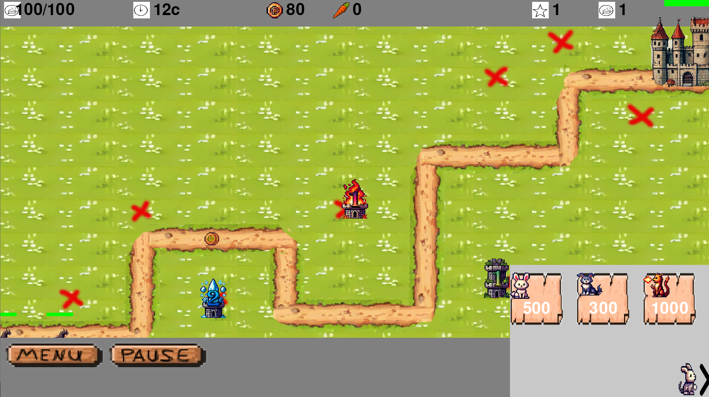
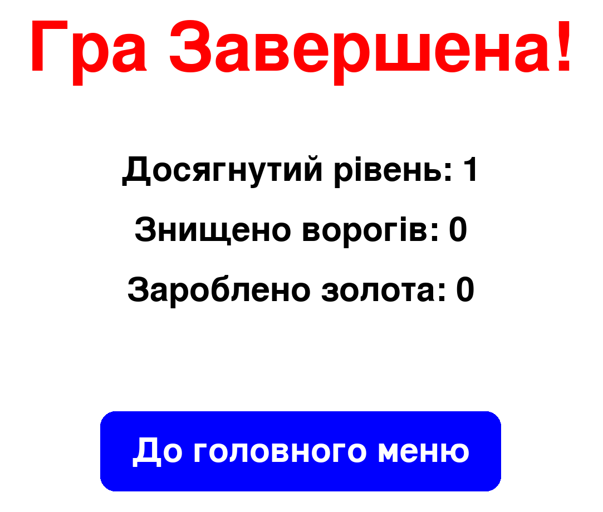

# toewrDefenceGame
Це гра жанру Tower Defense, в якій гравець розставляє оборонні вежі для захисту від хвиль ворогів. Гравець може стратегічно вибирати розташування веж для зупинення противників, що просуваються по карті.

## Опис геймплею

Гравець має кілька типів веж, кожна з яких має свої унікальні властивості. Завдання гри полягає в тому, щоб зупинити всі хвилі ворогів до того, як вони дійдуть до фінішу.

### Особливості:

- Кілька типів веж
- Різні типи ворогів з різними властивостями
- Покроковий прогрес і різні рівні складності

## Скриншоти

Ось кілька скриншотів геймплею:

### 1. Початковий екран


### 2. Вибір веж


### 3. Ігровий процес



### 4. Завершення гри



## Як запустити

1. Клонуйте репозиторій на свій комп'ютер.
2. Встановіть всі необхідні залежності.
```
pip install pygame
```
3. Запустіть гру командою:
```
pythom main.py
```

